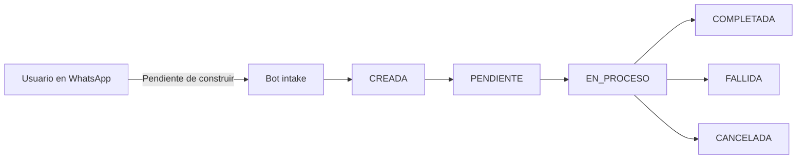

# Senda (senda-app)

Senda (senda-app) — repo único de Senda: landing de marketing y, a construir en el track Genesis del Argentina Builder Challenge, el producto de remesas a Argentina por WhatsApp con privacidad de monto sobre Stellar.

## Qué es Senda

**Problema.** Mandar dinero a Argentina desde el exterior es lento, caro, y expone montos y contrapartes en la mayoría de rieles (tradicionales y cripto) — riesgo real en un contexto donde exposición de patrimonio se asocia a extorsión. Soluciones que combinan WhatsApp + stablecoins (Félix, Whapay, Sati) resuelven velocidad/costo pero ninguna resuelve privacidad.

**Mercado.** Argentina recibió USD 944M en remesas en 2025 (corrección del 41% desde el pico de 2023). Corredores dominantes: EE.UU. y España (España concentra +450.000 argentinos en el exterior). LATAM y el Caribe en conjunto: USD 168.600M en 2025. Fuentes: DATAPAIS, The Dialogue vía Infobae, ONU/Banco Mundial, INE España.

**Solución (para el hackathon).** Remesas por WhatsApp inspiradas en Félix Pago — sin apps nuevas, sin explicar cripto, wallets no-custodiales, Stellar como settlement invisible. Privacidad con dos primitivas: Confidential Token (OpenZeppelin + verificador UltraHonk de Nethermind, ambos Developer Preview de Stellar, no aprobados para mainnet) oculta el monto pero mantiene visibles sender/recipient — usado en el MVP. Stellar Private Payments (SPP) oculta también la contraparte — queda en roadmap, no se construye en el hackathon.

## Estado actual del repo

Lo único implementado hoy en senda-app es la landing de marketing/pitch. El producto (bot de WhatsApp, wallet no-custodial, Confidential Token, off-ramp) está definido a nivel de producto pero su arquitectura técnica todavía no está resuelta — ver [Arquitectura técnica — PENDIENTE DE DEFINIR](#arquitectura-técnica--pendiente-de-definir) más abajo.

Todo dato visible en la landing (cotización, chat) es ilustrativo, no conectado a ningún backend real.

## Producto — funcionalidades previstas

| Funcionalidad | Tipo | Detalle | Estado |
| --- | --- | --- | --- |
| Bot de WhatsApp (intake) | Core | Intake del envío por chat | Pendiente de implementación |
| Wallet no-custodial | Core | Passkey / smart wallet Soroban | Pendiente de implementación |
| Máquina de estados de transacción | Core | CREADA → PENDIENTE → EN_PROCESO → COMPLETADA / FALLIDA / CANCELADA, con idempotencia | Pendiente de implementación |
| Wrapper Confidential Token sobre USDC | Core | Oculta el monto; sender/recipient visibles | Pendiente de implementación |
| Transferencia confidencial | Core | Movimiento del valor con Confidential Token | Pendiente de implementación |
| Retiro / unwrap a USDC estándar | Core | Salida del wrapper a USDC | Pendiente de implementación |
| Off-ramp a riel local | Core | Partner ya integrado con Stellar en Argentina (Anclap/Settle — no se construye desde cero) | Pendiente de implementación |
| Mensajes sin lenguaje cripto | Core | Copy de producto sin jerga de chain | Pendiente de implementación |
| Alerta proactiva de estado | Stretch | Aviso de avance del envío | Pendiente de implementación |
| Panel interno de transacciones | Stretch | Vista interna de operaciones | Pendiente de implementación |

## Arquitectura técnica — PENDIENTE DE DEFINIR

La arquitectura de implementación del producto todavía no está definida. Esta sección se completa cuando el equipo defina cada punto:

- [ ] Bot de WhatsApp — proveedor/API, cómo se conecta al backend
- [ ] Wallet no-custodial — passkey vs. smart wallet Soroban, SDK a usar
- [ ] Contrato Confidential Token — despliegue, red (testnet/mainnet), integración con el SDK de Nethermind/OpenZeppelin
- [ ] Máquina de estados de transacción — dónde vive (¿Prisma + Postgres del stack actual? ¿otro servicio?), cómo se sincroniza con el estado on-chain
- [ ] Integración con off-ramp (Anclap/Settle) — acceso a sandbox, contrato de API
- [ ] Relación entre este backend de producto y la landing actual (¿mismo deploy, o separados dentro de senda-app?)

## Flujos confirmados

Máquina de estados del producto (a construir):



Landing actual (contacto):

```mermaid
flowchart LR
  A[Usuario] --> B[Landing Next.js /es o /en]
  B --> C[Formulario de contacto]
  C --> D[sendanetwork@gmail.com]
```

## Stack

- Next.js 15
- React 19
- Prisma
- tRPC
- NextAuth
- Tailwind 4

La landing actual usa Next.js/React/Tailwind/next-intl; Prisma/tRPC/NextAuth están disponibles en el stack pero su rol en el producto final está sujeto a la arquitectura pendiente de definir.

## Cómo correr el proyecto

```bash
git clone https://github.com/SendaLabs/Senda.App.git
cd Senda.App
npm install
cp .env.example .env
npm run dev
```

`DATABASE_URL` es obligatorio al arrancar (Next valida el entorno al cargar la config) aunque la landing no la use en runtime. En `.env.example` el valor de desarrollo es `file:./db.sqlite`.

Otros scripts:

```bash
npm run build
npm start
npm run db:push
npm run lint
```

La landing queda en `http://localhost:3000/es` y `http://localhost:3000/en`.

## Roadmap del track Genesis

| Fecha | Checkpoint | Criterio de listo |
| --- | --- | --- |
| 20/09 | Checkpoint 1 | Contrato en testnet responde aprobar/rechazar con datos de prueba |
| 24/09 | Checkpoint 2 | Mensaje real de WhatsApp dispara el flujo completo hasta pago o rechazo |
| 27/09 | Submission final | Todo estable + pitch deck + demo |

**Riesgos (contexto del track).** Contratos en Developer Preview no auditados (alcance queda en testnet, se comunica así); dependencia de Nethermind/OpenZeppelin vía SDK público; wallet no-custodial (passkey) es superficie nueva para el equipo; off-ramp depende de acceso/sandbox de Anclap/Settle, a confirmar antes del Checkpoint 1.

## Contacto

sendanetwork@gmail.com
