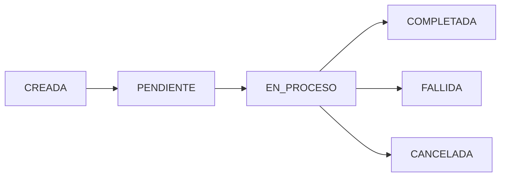

# Senda

Senda es una plataforma de operaciones financieras para pymes de América Latina, con un wedge de entrada en pagos y remesas vía WhatsApp liquidados sobre Stellar. Este repositorio (`senda-app`) contiene la landing de marketing y el producto de remesas a Argentina construido para el Stellar Argentina Builders Challenge (Stellar x BAF). El backend de producto vive en un repositorio separado, `senda-backend`.

## Qué es Senda

Senda mueve dinero desde WhatsApp hasta pesos gastables en Mercado Pago, liquidando el settlement en Stellar de forma invisible para el usuario. No hay wallets que configurar, ni jerga cripto, ni apps nuevas que instalar: el usuario manda un mensaje y el dinero llega.

## Problema

Argentina es uno de los mercados de mayor adopción de stablecoins de la región (~US$93.900M en transacciones cripto entre 2022 y 2025, ~94% en stablecoins), pero no tiene todavía un producto consumer-facing nativo de Stellar que use WhatsApp como interfaz. El ecosistema Stellar ya validó ese patrón a escala — pero fuera de Argentina.

En paralelo, el freelancer o contratista argentino que cobra en dólares o stablecoins del exterior sigue necesitando convertir eso en pesos gastables de forma simple, sin exponerse a jerga cripto ni a fricción fiscal innecesaria.

## Solución

WhatsApp como interfaz de envío. Liquidación directa en Mercado Pago. Settlement invisible sobre Stellar, con wallets no-custodiales bajo el capó.

El diferenciador técnico es la privacidad de monto: Senda envuelve USDC en un Confidential Token (SDK de OpenZeppelin + verificador UltraHonk de Nethermind, ambos en Developer Preview de Stellar, no aprobados aún para mainnet), de forma que el monto de la transacción no queda expuesto on-chain. En el MVP, remitente y destinatario siguen siendo visibles; ocultar también la contraparte (Stellar Private Payments) queda en el roadmap.

## Usuario

**Familia recibiendo remesas** — desde España, Italia, Chile o Estados Unidos, liquidado en pesos en Mercado Pago. Es el caso de uso acotado y demoable del hackathon.

**Freelancers y contratistas argentinos** que cobran en USD o stablecoins del exterior y necesitan convertir eso en pesos gastables, sin lenguaje cripto ni wallets que configurar.

## Por qué ahora

El ecosistema Stellar ya tiene un caso de éxito que valida este patrón a escala de mercado (WhatsApp → USDC → efectivo local), y ese jugador está expandiendo agresivamente sus corredores en Latinoamérica con capital fresco, sin haber entrado todavía a Argentina. Es una ventana de tiempo: quien construya primero la pieza de infraestructura consumer-facing de Stellar en Argentina se queda con la posición de entrada.

## Competencia rápida

| | Senda (objetivo) | Félix Pago | Peanut |
|---|---|---|---|
| Interfaz | WhatsApp | WhatsApp | Link (WA/SMS/mail) + QR |
| Last mile en Argentina | Mercado Pago | No opera (roadmap sin AR) | Mercado Pago / banco AR |
| Settlement | Stellar (invisible) | Stellar (USDC) | Solana + EVM (no Stellar) |
| Privacidad de monto | Sí (Confidential Token, MVP/testnet) | No es el wedge público | No es el wedge público |
| Cobertura AR | Entrada / piloto | Ausente hoy | Presente |
| Costo al usuario | A definir con off-ramp local | Remesa WA competitiva vs. WU | Bajo / $0 en varios flujos QR |
| Riesgo competitivo | — | Capital para expandir a AR | Ya local, otro rail |

Félix Pago: unicornio (~US$1.400M), Serie C de US$200M (sept. 2026, equity liderado por a16z + deuda de General Catalyst), US$8.000M+ procesados, 11 países. Peanut: ganador de Startup World Cup en Devconnect Argentina 2025.

Fuentes de contexto de mercado (no son prueba de tracción de Senda): DATAPAIS/The Dialogue vía Infobae, ONU-Banco Mundial, INE España, BBVA Research, cobertura de la Serie C de Félix (Crunchbase/LatamList, sept. 2026), sitio de Peanut y cobertura de Startup World Cup Devconnect 2025.

## Estado actual del repo

`senda-app` contiene la landing de marketing/pitch. El backend de producto (bot de WhatsApp, wallet no-custodial, Confidential Token, off-ramp) vive en `senda-backend`.

Contrato Confidential Token deployado en testnet:
`CDT2MY3QNV2RT2XULQWWXX2JELUWRWNXNKONCYG5MTIGZM7G5S2QNNGB`
Transacción de deploy: https://stellar.expert/explorer/testnet/tx/73d29efa73a9c3a2c4d28f91a60dda250a5d437d6be77a93b47069660f1da5fe

Todo dato visible en la landing (cotización, chat) es ilustrativo, no conectado a ningún backend real.

## Producto: funcionalidades previstas

| Funcionalidad | Tipo | Detalle |
|---|---|---|
| Bot de WhatsApp (intake) | Core | Intake del envío por chat |
| Wallet no-custodial | Core | Passkey / smart wallet Soroban |
| Máquina de estados de transacción | Core | CREADA → PENDIENTE → EN_PROCESO → COMPLETADA / FALLIDA / CANCELADA, con idempotencia |
| Wrapper Confidential Token sobre USDC | Core | Oculta el monto; remitente y destinatario visibles |
| Transferencia confidencial | Core | Movimiento del valor con Confidential Token |
| Retiro / unwrap a USDC estándar | Core | Salida del wrapper a USDC |
| Off-ramp a riel local | Core | Partner ya integrado con Stellar en Argentina (Anclap/Settle) |
| Mensajes sin lenguaje cripto | Core | Copy de producto sin jerga de chain |
| Alerta proactiva de estado | Stretch | Aviso de avance del envío |
| Panel interno de transacciones | Stretch | Vista interna de operaciones |

## Arquitectura técnica

- Bot de WhatsApp — proveedor/API, conexión al backend.
- Wallet no-custodial — passkey vs. smart wallet Soroban, SDK a usar.
- Contrato Confidential Token — desplegado en testnet (ID y transacción arriba), integración con el SDK de Nethermind/OpenZeppelin.
- Máquina de estados de transacción — persistencia (Prisma + Postgres del stack actual u otro servicio), sincronización con el estado on-chain.
- Integración con off-ramp (Anclap/Settle) — acceso a sandbox, contrato de API.
- Relación entre `senda-backend` y `senda-app` — despliegues separados, comunicación vía API.

## Flujos

Máquina de estados del producto:



Landing (contacto):

```mermaid
flowchart LR
  A[Usuario] --> B[Landing Next.js /es o /en]
  B --> C[Formulario de contacto]
  C --> D[sendanetwork@gmail.com]
```

## Stack

- Next.js 15
- React 19
- Prisma
- tRPC
- NextAuth
- Tailwind 4
- next-intl

La landing usa Next.js/React/Tailwind/next-intl. Prisma/tRPC/NextAuth están disponibles en el stack; su rol final depende de cómo se conecte `senda-app` con `senda-backend`.

## Cómo correr el proyecto

```bash
git clone https://github.com/SendaLabs/Senda.App.git
cd Senda.App
npm install
cp .env.example .env
npm run dev
```

`DATABASE_URL` es obligatorio al arrancar (Next valida el entorno al cargar la config) aunque la landing no la use en runtime. En `.env.example` el valor de desarrollo es `file:./db.sqlite`.

Otros scripts:

```bash
npm run build
npm start
npm run db:push
npm run lint
```

La landing queda en `http://localhost:3000/es` y `http://localhost:3000/en`.

## Roadmap del Stellar Argentina Builders Challenge

| Fecha | Checkpoint | Criterio de listo |
|---|---|---|
| 20/09 | Checkpoint 1 | Contrato en testnet responde aprobar/rechazar con datos de prueba |
| 24/09 | Checkpoint 2 | Mensaje real de WhatsApp dispara el flujo completo hasta pago o rechazo |
| 27/09 | Submission final | Todo estable + pitch deck + demo |

Riesgos: contratos en Developer Preview no auditados (alcance en testnet); dependencia del SDK público de Nethermind/OpenZeppelin; wallet no-custodial (passkey) es superficie nueva para el equipo; off-ramp depende de acceso/sandbox de Anclap/Settle, a confirmar antes del Checkpoint 1.

## Roadmap global

1. **Piloto de remesas Argentina** — validar el flujo WhatsApp → Confidential Token → Mercado Pago con datos reales, más allá del demo.
2. **Extensión de privacidad** — Stellar Private Payments para ocultar también remitente/destinatario, cuando salga de Developer Preview.
3. **Expansión de corredores** — otros países LATAM con adopción alta de stablecoins y sin cobertura de Stellar consumer-facing.
4. **Senda Business** — ver sección siguiente.

## Senda Business: pagos para empresas a través de fronteras

La tesis de fondo de Senda es un Financial Operations Platform para pymes de LATAM, con wedge de entrada en Accounts Payable: factura → aprobación → pago → conciliación. El ADN de "fondos por proyecto/presupuesto" (Fund/Project/Budget) es el diferenciador de ontología frente a plataformas tipo Ramp (Company → Department → Employee).

Senda Ledger unifica bancos, stablecoins y tarjetas sin obligar a mover fondos a cripto. El Payment Router decide la mejor ruta de pago (banco, stablecoin, riel local) componiéndose sobre partners de ruteo ya existentes (Bitso Business, CoralCommerce, Eco), no construido desde cero. El Senda Asistente es la capa conversacional (WhatsApp) integrada dentro de Senda para consultas sobre el Senda Ledger real — no asesora sobre inversión ni impuestos.

La infraestructura construida para el hackathon (bot de WhatsApp, wallet no-custodial, settlement invisible sobre Stellar) es la misma pieza que después soporta pagos de negocio a través de fronteras — factura de un proveedor en otro país, pago de un freelancer, conciliación multi-moneda —, no una remesa familiar, pero el mismo riel.

## Contacto

sendanetwork@gmail.com
