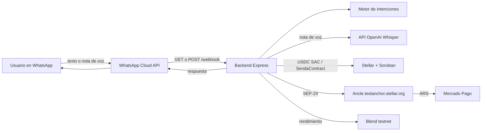
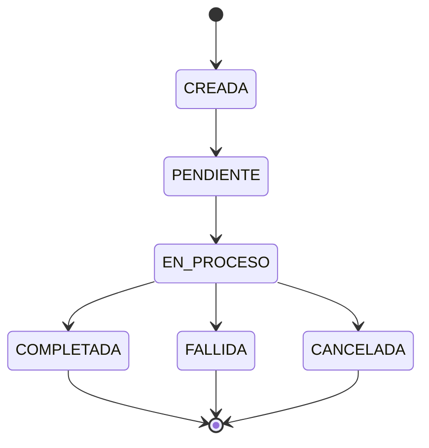
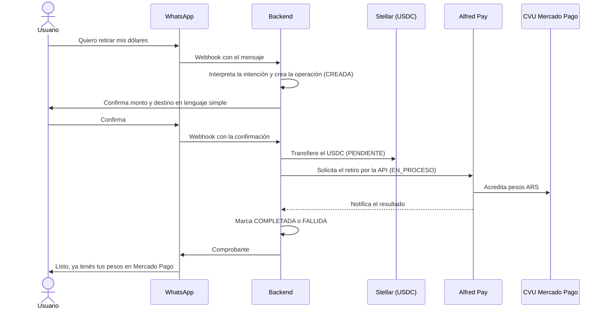
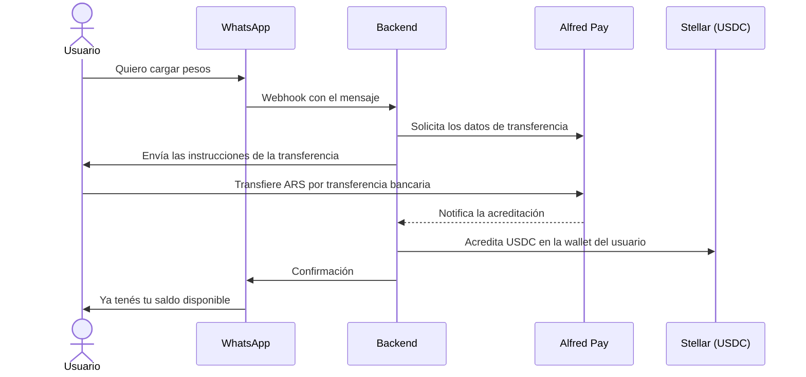
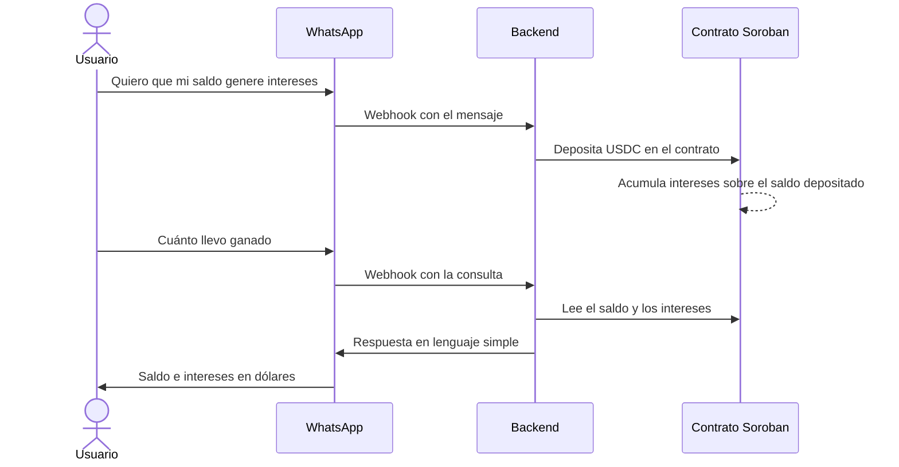
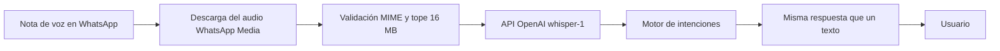

# Senda

Senda es una plataforma de operaciones financieras para pymes de América Latina, con un wedge de entrada en pagos y remesas vía WhatsApp liquidados sobre Stellar. Este repositorio (Senda.App) contiene la landing de marketing y el producto de remesas a Argentina. El backend de producto vive en un repositorio separado, [senda-backend](https://github.com/SendaLabs/senda-backend).

## Qué es Senda

¿Y si pudieras enviar dinero a través de fronteras tan rápido como un mensaje de texto? Movemos dinero desde WhatsApp hasta pesos gastables en Mercado Pago, liquidando el settlement en Stellar de forma invisible para el usuario. Sin wallets que configurar, sin apps nuevas, sin jerga cripto: el usuario manda un mensaje y el dinero llega.

Senda es una billetera conversacional con IA, orientada a la inclusión financiera masiva: el usuario opera con lenguaje natural, por texto o por nota de voz, dentro de WhatsApp.

## Problema

Los freelancers, creadores y trabajadores independientes en América Latina pierden hasta un 10% o más de sus ingresos en comisiones abusivas, demoras de varios días y burocracia bancaria tradicional cuando intentan cobrar desde el exterior hacia sus cuentas locales.

Cada vez más profesionales cobran del exterior sin haberse ido del país. Según Bitwage by Paystand, casi el 40% de esos pagos en su plataforma van a profesionales ubicados en Argentina. Un diseñador que trabaja para una startup de Estados Unidos, un desarrollador contratado por una empresa europea, una consultora que presta servicios a clientes internacionales: ese dinero cruza fronteras de una forma muy parecida a una remesa tradicional.

Las stablecoins como USDC resuelven el problema de velocidad y costo, pero obligan al usuario no cripto a lidiar con wallets complejas, frases semilla, redes y gas fees como XLM, lo que frena la adopción masiva. Los canales tradicionales de pago internacional, como las transferencias bancarias o las plataformas intermediarias, son lentos y caros. Y operar con dinero en blockchains públicas expone los datos financieros del usuario a la vista de cualquiera, lo que desalienta su uso cotidiano o comercial serio sin cumplimiento normativo ni privacidad patrimonial.

## Solución

Construimos un chatbot de WhatsApp en español, impulsado por stablecoins USDC sobre la blockchain Stellar, para resolver esto. Abstraemos la complejidad cripto y la metemos dentro de WhatsApp, generando confianza a través de una interfaz familiar mientras usamos la blockchain por debajo para la velocidad y el bajo costo. Sin apps nuevas, sin wallets que configurar, sin frases semilla, sin gas fees que manejar: el usuario manda un mensaje y el dinero llega, liquidado directo en Mercado Pago.

El diferenciador técnico es la privacidad de monto: envolvemos USDC en un Confidential Token (SDK de OpenZeppelin + verificador UltraHonk de Nethermind, ambos en Developer Preview de Stellar, no aprobados aún para mainnet), de forma que el monto de la transacción no queda expuesto on-chain. En el MVP, remitente y destinatario siguen siendo visibles; ocultar también la contraparte (Stellar Private Payments) queda en el roadmap.

## Usuario

Freelancers y contratistas argentinos que cobran en USD o stablecoins del exterior y necesitan convertir eso en pesos gastables, sin lenguaje cripto ni wallets que configurar.

Familia recibiendo remesas — desde España, Italia, Chile o Estados Unidos, liquidado en pesos en Mercado Pago. Es el caso de uso acotado y demostrable del MVP.

## Por qué ahora

El objetivo es evolucionar de un servicio de remesas y pagos a un ecosistema financiero completo, integrando tecnología blockchain y stablecoins para ofrecer rapidez, transparencia y valor adicional en cada interacción. El foco no está solo en mover dinero, sino en convertir cada transacción en una oportunidad de generar servicios financieros accesibles, seguros y escalables para los usuarios en Argentina y el exterior.

El futuro de las remesas no debería medirse por el número de transferencias depositadas en cuentas o pagadas directamente en efectivo. Una medida mucho más informativa es la proporción de fondos que permanecen activos dentro de los ecosistemas digitales financieros. Cada remesa digital no es un fin en sí misma, sino el inicio de un círculo virtuoso de inclusión, resiliencia y crecimiento local. La verdadera transformación ocurre cuando el dinero que llega permanece, circula y genera oportunidades.

El ecosistema Stellar ya tiene un caso de éxito que valida este patrón a escala de mercado (WhatsApp → USDC → efectivo local), y ese jugador está expandiendo agresivamente sus corredores en Latinoamérica con capital fresco, sin haber entrado todavía a Argentina. Es una ventana de tiempo: quien construya primero la pieza de infraestructura consumer-facing de Stellar en Argentina se queda con la posición de entrada.

## Competencia rápida

| | Senda (objetivo) | Félix Pago | Peanut |
|---|---|---|---|
| Interfaz | WhatsApp | WhatsApp | Link (WA/SMS/mail) + QR |
| Last mile en Argentina | Mercado Pago | No opera (roadmap sin AR) | Mercado Pago / banco AR |
| Settlement | Stellar (invisible) | Stellar (USDC) | Solana + EVM (no Stellar) |
| Privacidad de monto | Sí (Confidential Token, MVP/testnet) | No es el wedge público | No es el wedge público |
| Cobertura AR | Entrada / piloto | Ausente hoy | Presente |
| Costo al usuario | A definir con el off-ramp local | Remesa WA competitiva vs. WU | Bajo / $0 en varios flujos QR |
| Riesgo competitivo | — | Capital para expandir a AR | Ya local, otro rail |

Félix Pago: unicornio (~US$1.400M), Serie C de US$200M (sept. 2026, equity liderado por a16z + deuda de General Catalyst), US$8.000M+ procesados, 11 países.

Fuentes de contexto de mercado (no son prueba de tracción de Senda): DATAPAIS/The Dialogue vía Infobae, ONU-Banco Mundial, INE España, BBVA Research, cobertura de la Serie C de Félix (Crunchbase/LatamList, sept. 2026), sitio de Peanut, Bitwage by Paystand, y el informe "Remesas 2030" (Mastercard x CrossTech).

## Estado actual del repo

Senda.App contiene la landing de marketing/pitch. El backend de producto (bot de WhatsApp, custodia invisible SEP-30, USDC sobre Stellar, retiro y rendimientos) vive en senda-backend.

En testnet el backend usa el Stellar Asset Contract de USDC `CDT2MY3QNV2RT2XULQWWXX2JELUWRWNXNKONCYG5MTIGZM7G5S2QNNGB` (`USDC_SAC_CONTRACT_ID`). El contrato Soroban propio (`SendaContract`, `STELLAR_CONTRACT_ID`) registra créditos y saldos (`ping`, `credit`, `balance`); no es un Confidential Token.

Todo dato visible en la landing (cotización, chat) es ilustrativo, no conectado a ningún backend real.

## Producto: funcionalidades previstas

| Funcionalidad | Tipo | Detalle |
|---|---|---|
| Bot de WhatsApp (intake) | Core | Intake del envío por chat, por texto o nota de voz |
| Wallet no-custodial | Core | Passkey / smart wallet Soroban |
| Máquina de estados de transacción | Core | CREADA → PENDIENTE → EN_PROCESO → COMPLETADA / FALLIDA / CANCELADA, con idempotencia |
| Wrapper Confidential Token sobre USDC | Core | Oculta el monto; remitente y destinatario visibles |
| Transferencia confidencial | Core | Movimiento del valor con Confidential Token |
| Retiro / unwrap a USDC estándar | Core | Salida del wrapper a USDC |
| Off-ramp a riel local | Core | Retiro de USDC a pesos en el CVU de Mercado Pago vía la API de Alfred Pay |
| On-ramp | Core | Ingreso de pesos por transferencia tradicional, convertidos automáticamente a USDC sobre Stellar |
| Rendimientos | Core | Intereses pasivos en dólares digitales mediante contratos inteligentes de Soroban |
| Mensajes sin lenguaje cripto | Core | Copy de producto sin jerga de chain |
| Alerta proactiva de estado | Stretch | Aviso de avance del envío |
| Panel interno de transacciones | Stretch | Vista interna de operaciones |

Hoy en senda-backend ya corren, sobre testnet: intake por WhatsApp (texto y nota de voz), custodia invisible SEP-30 (y wallets MPC de Privy si `USE_PRIVY_WALLETS=true`), acreditación y saldo de USDC, retiro en efectivo simulado, retiro a Mercado Pago por SEP-24, y rendimiento en el pool Blend. No hay Confidential Token, on-ramp ni integración con Alfred Pay.

## Arquitectura técnica

### Componentes

| Componente | Tecnología | Rol |
|---|---|---|
| Landing | Next.js 15, React 19, Tailwind 4, next-intl | Marketing y pitch en Senda.App |
| Backend | Node.js (>= 22.12.0) / TypeScript / Express | Webhook de WhatsApp, motor de intenciones, transcripción, orquestación |
| Transcripción | API de OpenAI (`whisper-1`) | Nota de voz → texto |
| Capa blockchain | Stellar (USDC SAC) + `SendaContract` en Soroban | Settlement, crédito y saldo |
| Rendimientos | Blend (testnet) | Supply / consulta / withdraw de USDC |
| Off-ramp Mercado Pago | SEP-24 contra `testanchor.stellar.org` | Retiro interactivo a Mercado Pago |
| Off-ramp efectivo | Órdenes simuladas (MoneyGram, Western Union, comercio Senda) | Código de retiro y lock de USDC |
| On-ramp / Alfred Pay | Previsto | No está implementado en senda-backend |
| Interfaz de chat | WhatsApp Cloud API (`v22.0`) | Canal del usuario |

### Cómo interactúan



### Piezas

- **Bot de WhatsApp:** WhatsApp Cloud API (versión `v22.0` por defecto). El backend expone `GET /webhook` para la verificación de Meta y `POST /webhook` para los mensajes, que se validan con la firma `X-Hub-Signature-256` usando el App Secret de Meta. También sirve `GET /health` y `GET /media/welcome.mp4`.
- **Wallet:**
  - Diseño: no-custodial (passkey / smart wallet Soroban).
  - Hoy: custodia invisible SEP-30; Privy MPC solo si `USE_PRIVY_WALLETS=true`.
- **Confidential Token:**
  - Diseño: envoltura de USDC con Confidential Token (OpenZeppelin + verificador UltraHonk de Nethermind).
  - Hoy: el contrato propio del backend es `SendaContract` (`ping` / `credit` / `balance`) vía `STELLAR_CONTRACT_ID`; no hay Confidential Token integrado en senda-backend.
- **Persistencia:** el bot escribe JSON en el directorio de datos (`senda-db.json`, sesiones, órdenes de retiro). Prisma existe como referencia (`DATABASE_URL` por defecto `file:../data/senda.db`) y no está activo. Los mensajes de WhatsApp se deduplican por id; los créditos usan un claim idempotente.
- **Off-ramp:** Mercado Pago vía SEP-10 + SEP-24 (ancla de test). El efectivo (MoneyGram, Western Union, comercio) es una orden simulada que bloquea USDC en el vault de retiro. Alfred Pay es la pasarela prevista, no un cliente en el código.
- **Relación entre senda-backend y Senda.App:** despliegues separados. La landing no llama al backend.

## Flujos

### Máquina de estados del producto

Diseño: CREADA → PENDIENTE → EN_PROCESO → COMPLETADA / FALLIDA / CANCELADA, con idempotencia.



Cada transición es idempotente: reintentar el mismo mensaje o la misma llamada no duplica la operación.

Hoy: la conversación usa estados `AWAITING_*`; el retiro en efectivo usa `pending_lock` / `pending_pickup` y otros; SEP-24 usa `pending`. La persistencia es `data/senda-db.json`; Prisma en el backend no está activo.

### Flujo de retiro (Off-Ramp)

Diseño: retiro de USDC por WhatsApp hasta que los ARS se acreditan en el CVU de Mercado Pago vía la API de Alfred Pay.



Hoy: el retiro a Mercado Pago funciona por SEP-24 contra `testanchor.stellar.org`; el retiro en efectivo (MoneyGram / WU / comercio) es simulado; no hay cliente de Alfred Pay.

### Flujo de ingreso (On-Ramp)

Diseño: transferencia de pesos convertida automáticamente a USDC sobre Stellar, vía Alfred Pay.



Hoy: no hay on-ramp implementado.

### Flujo de rendimientos

Diseño: contratos Soroban que generan intereses pasivos en dólares digitales, comunicados al usuario en lenguaje simple.



Comunicación al usuario: los intereses se informan en dólares y sin términos técnicos (nada de pools, APY, gas ni contratos). El usuario ve cuánto tiene y cuánto ganó, y puede retirar cuando quiera con el flujo de retiro.

Hoy: el rendimiento funciona contra un pool de Blend en testnet (`SupplyCollateral` / `WithdrawCollateral`).

### Arquitectura de IA y voz

**Motor de intenciones.** Cada mensaje de texto pasa por `intent.service.ts`, que clasifica lenguaje natural en español y decide la acción: saldo, enviar USDC, retiro en efectivo, retiro a Mercado Pago, rendimiento (poner, consultar, sacar) o menú. Si falta un dato (por ejemplo el monto o la red de efectivo), el bot lo pide en la misma conversación antes de ejecutar.

**Pipeline de notas de voz.**

Diseño: Whisper ejecutado de forma local.

Hoy: la transcripción funciona con Whisper (whisper-1) a través de la API de OpenAI, y requiere `OPENAI_API_KEY`.



1. El webhook recibe el mensaje de audio y descarga el archivo desde WhatsApp Media.
2. Se valida el MIME y se rechaza si supera 16 MB.
3. Mandamos el audio a `https://api.openai.com/v1/audio/transcriptions` (`OPENAI_API_KEY`, modelo `whisper-1` por defecto, idioma `es`).
4. El texto entra al mismo motor de intenciones que un mensaje escrito.
5. El bot responde con la misma intención.

## Stack

- Next.js 15
- React 19
- Prisma
- tRPC
- NextAuth
- Tailwind 4
- next-intl

La landing usa Next.js/React/Tailwind/next-intl. Prisma/tRPC/NextAuth están disponibles en el stack; su rol final depende de cómo se conecte Senda.App con senda-backend.

## Cómo correr el proyecto

### Landing (Senda.App)

```bash
git clone https://github.com/SendaLabs/Senda.App.git
cd Senda.App
npm install
cp .env.example .env    # en Windows (cmd): copy .env.example .env
npm run dev
```

`DATABASE_URL` es obligatorio al arrancar (Next valida el entorno al cargar la config) aunque la landing no la use en runtime. En `.env.example` el valor de desarrollo es `file:./db.sqlite`.

Otros scripts:

```bash
npm run build
npm start
npm run db:push
npm run lint
```

La landing queda en http://localhost:3000/es y http://localhost:3000/en.

### Backend (senda-backend)

Requisitos previos:

- Node.js >= 22.12.0 y npm
- Rust y Stellar CLI (para compilar y desplegar el contrato Soroban)
- Una app de Meta con WhatsApp Cloud API (token, ID de número de teléfono, ID de cuenta de negocio y App Secret)
- Una URL pública para el webhook (por ejemplo el deploy en Render)
- `OPENAI_API_KEY` si vas a transcribir notas de voz

```bash
git clone https://github.com/SendaLabs/senda-backend.git
cd senda-backend
npm install
cp .env.example .env    # en Windows (cmd): copy .env.example .env
npm run dev
```

Scripts:

| Script | Qué hace |
|---|---|
| `npm run dev` | Servidor en desarrollo con recarga (nodemon + ts-node) |
| `npm run build` | Compila TypeScript a `dist/` |
| `npm start` | Ejecuta `dist/index.js` |
| `npm run typecheck` | Verifica tipos sin compilar |
| `npm test` | Corre los tests de `src/services/*.test.ts` |
| `npm run contract:build` | Compila el contrato Soroban (`stellar contract build`) |
| `npm run contract:deploy` | Despliega el contrato (`scripts/deploy-contract.js`) |

Para conectar WhatsApp, configura el webhook de la app de Meta con `https://<tu-url-publica>/webhook` y el mismo valor que pusiste en `VERIFY_TOKEN`.

### Variables de entorno (`.env` del backend)

Nunca se commitean valores reales. Las variables sin valor por defecto se completan con tus propias credenciales.

| Variable | Obligatoria | Descripción |
|---|---|---|
| `PORT` | No | Puerto del servidor (por defecto `3000`) |
| `NODE_ENV` | No | Entorno (`development` en `.env.example`) |
| `WHATSAPP_TOKEN` | Sí | Token de acceso de WhatsApp Cloud API |
| `WHATSAPP_PHONE_NUMBER_ID` | Sí | ID del número de teléfono de WhatsApp Business |
| `WHATSAPP_BUSINESS_ACCOUNT_ID` | No | ID de la cuenta de WhatsApp Business (está en `.env.example`; el runtime no la lee) |
| `WHATSAPP_API_VERSION` | No | Versión de la API (por defecto `v22.0`) |
| `VERIFY_TOKEN` | Sí | Token de verificación del webhook. En `.env.example` es `senda-verify-token`. Si está vacío, el GET `/webhook` responde 403 |
| `WHATSAPP_APP_SECRET` | Sí | App Secret de Meta; firma `X-Hub-Signature-256` del webhook. Sin este valor el POST `/webhook` responde 403 |
| `PUBLIC_BASE_URL` | No | URL pública del backend; Render setea `RENDER_EXTERNAL_URL` solo. Construye `/media/welcome.mp4` si no hay `WELCOME_VIDEO_URL` |
| `WELCOME_VIDEO_URL` | No | URL absoluta del video de bienvenida. Si no está, usamos `PUBLIC_BASE_URL` o `RENDER_EXTERNAL_URL` + `/media/welcome.mp4` |
| `STELLAR_NETWORK` | Sí | Red de Stellar (`testnet`) |
| `STELLAR_HORIZON_URL` | Sí | Horizon (`https://horizon-testnet.stellar.org`) |
| `STELLAR_RPC_URL` | Sí | RPC de Soroban (`https://soroban-testnet.stellar.org`) |
| `STELLAR_FRIENDBOT_URL` | Sí (testnet) | Friendbot (`https://friendbot.stellar.org`) |
| `STELLAR_NETWORK_PASSPHRASE` | Sí | Passphrase de la red (`Test SDF Network ; September 2015`) |
| `STELLAR_CONTRACT_ID` | No | ID de `SendaContract`. Sin este valor no registramos el crédito en el contrato Soroban |
| `STELLAR_PUBLIC_KEY` | No | Clave pública de la cuenta operativa (está en `.env.example`; el runtime firma con `STELLAR_SECRET_KEY`) |
| `STELLAR_SECRET_KEY` | Sí | Clave secreta de la cuenta operativa |
| `USDC_SAC_CONTRACT_ID` | Sí | Stellar Asset Contract de USDC (`CDT2MY3QNV2RT2XULQWWXX2JELUWRWNXNKONCYG5MTIGZM7G5S2QNNGB`) |
| `USDC_CODE` | Sí | Código del activo (`USDC`) |
| `USDC_ISSUER` | Sí | Emisor del USDC (`GBBD47IF6LWK7P7MDEVSCWR7DPUWV3NY3DTQEVFL4NAT4AQH3ZLLFLA5`) |
| `CUSTODY_MASTER_SECRET` | Sí | Secreto de la custodia invisible (SEP-30); distinto de `STELLAR_SECRET_KEY` |
| `FILE_VAULT_SECRET` | Sí | Cifrado en reposo de códigos de retiro y wallets legado; distinto de los otros dos secretos |
| `STELLAR_OFFRAMP_PUBLIC_KEY` | Sí | Cuenta `G…` del vault de retiro en efectivo; distinta de la cuenta operativa |
| `OPENAI_API_KEY` | Para notas de voz | Clave de OpenAI para `POST /v1/audio/transcriptions` |
| `OPENAI_TRANSCRIPTION_MODEL` | No | Modelo de transcripción (`whisper-1`) |
| `USE_PRIVY_WALLETS` | No | `false` mantiene la custodia SEP-30; `true` usa wallets MPC de Privy |
| `PRIVY_APP_ID` | Si `USE_PRIVY_WALLETS=true` | ID de la app de Privy |
| `PRIVY_APP_SECRET` | Si `USE_PRIVY_WALLETS=true` | Secreto de la app de Privy |
| `DATABASE_URL` | No | Referencia Prisma (por defecto `file:../data/senda.db`); el bot usa `data/senda-db.json` |
| `SENDA_DATA_DIR` | No | Directorio de JSON (`senda-db.json`, sesiones, órdenes). Si no está, usamos `data/` bajo el cwd |
| `ENABLE_PUBLIC_CREDIT` | No | El crédito automático solo corre en testnet, salvo que esta variable sea `true` en red `public` |
| `SEP24_HOME_DOMAIN` | Sí | Dominio del ancla SEP-24 para el retiro a Mercado Pago (`testanchor.stellar.org`) |
| `BLEND_POOL_ID` | Sí | Pool de Blend en testnet para el rendimiento de USDC |
| `BLEND_USDC_SAC_ID` | No | SAC de USDC del pool Blend; si falta, usamos `USDC_SAC_CONTRACT_ID` |

`CUSTODY_MASTER_SECRET`, `FILE_VAULT_SECRET` y `STELLAR_SECRET_KEY` deben ser tres valores distintos entre sí.

## Hitos

| Fecha | Hito | Criterio de listo |
|---|---|---|
| 20/09 | Hito 1 | Contrato en testnet responde aprobar/rechazar con datos de prueba |
| 24/09 | Hito 2 | Mensaje real de WhatsApp dispara el flujo completo hasta pago o rechazo |
| 27/09 | Entrega final | Todo estable + pitch deck + demo |

Riesgos: el Confidential Token previsto depende de SDKs en Developer Preview (alcance en testnet); la custodia SEP-30 y los secretos de vault son superficie nueva para nosotros; el off-ramp a Mercado Pago depende del ancla SEP-24 de test; el efectivo es simulado; el on-ramp y Alfred Pay todavía no están en el backend.

## Documentación
Pitch (Argentina Builder Challenge): https://docs.google.com/document/d/1Q49nLCfl-VOjWNQluKXtgg08m6D_J819PBCLaIwA4A0/edit?tab=t.0
Pitch Deck (Argentina Builder Challenge): https://docs.google.com/presentation/d/1do1UYuHVPNFeT5q73hg-zqoBYkwjHBqfkWqDd4CdV1U/edit?usp=sharing

## Roadmap global

1. **Piloto de remesas Argentina** — validar el flujo WhatsApp → Confidential Token → Mercado Pago con datos reales, más allá del demo.
2. **Extensión de privacidad** — Stellar Private Payments para ocultar también remitente/destinatario, cuando salga de Developer Preview.
3. **Expansión de corredores** — otros países LATAM con adopción alta de stablecoins y sin cobertura de Stellar consumer-facing.
4. **Senda Business** — ver sección siguiente.

## Senda Business: pagos para empresas a través de fronteras

Nuestra tesis de fondo es un Financial Operations Platform para pymes de LATAM, con wedge de entrada en Accounts Payable: factura → aprobación → pago → conciliación. El ADN de "fondos por proyecto/presupuesto" (Fund/Project/Budget) es el diferenciador de ontología frente a plataformas tipo Ramp (Company → Department → Employee).

Senda Ledger unifica bancos, stablecoins y tarjetas sin obligar a mover fondos a cripto. El Payment Router decide la mejor ruta de pago (banco, stablecoin, riel local) componiéndose sobre partners de ruteo ya existentes (Bitso Business, CoralCommerce, Eco), sin construirlo desde cero. El Senda Asistente es la capa conversacional (WhatsApp) integrada dentro de Senda para consultas sobre el Senda Ledger real; no asesora sobre inversión ni impuestos.

La infraestructura que estamos construyendo (bot de WhatsApp, wallet, settlement invisible sobre Stellar) es la misma pieza que después soporta pagos de negocio a través de fronteras — factura de un proveedor en otro país, pago de un freelancer, conciliación multi-moneda —, no una remesa familiar, pero el mismo riel.

## Contacto

sendanetwork@gmail.com
