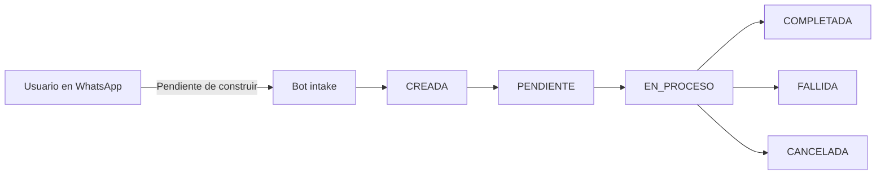

# Senda (senda-app)

Senda (senda-app) — repo único de Senda: landing de marketing y, a construir en el track Genesis del Argentina Builder Challenge, el producto de remesas a Argentina por WhatsApp con privacidad de monto sobre Stellar.

## Qué es Senda

### Problema (brecha de presencia, no “mercado virgen”)

El valor de este track **no** es “descubrimos un problema de remesas argentinas que nadie resolvió”. Ese framing es fácil de refutar: velocidad y costo frente a Western Union ya los atacan productos vivos.

Hoy conviven dos jugadores serios en la misma zona de producto:

| Jugador | Qué ya demostró | Relación con Argentina / Stellar |
| --- | --- | --- |
| **Félix Pago** | Unicornio (~US$1.4B). Serie C de US$200M (sept. 2026; equity liderada por a16z + deuda de General Catalyst). WhatsApp → USDC sobre **Stellar** → efectivo/cuenta local. Reporta US$8B+ procesados y cobertura en **11 países** LATAM. | Roadmap/corredores anunciados: México, Brasil, Colombia, Ecuador, Perú, Centroamérica, etc. **Argentina no figura** en el mapa declarado. Coherente con un TAM de remesas familiares más chico que esos destinos (BBVA Research). |
| **Peanut** | Ganador Startup World Cup (Devconnect Argentina 2025). Remesas/pagos vía link (WhatsApp/SMS) y QR → **Mercado Pago**, sin DNI para el foráneo. | **Sí opera en Argentina**, pero el settlement corre sobre **Solana / Arbitrum / Base / Tron / Polygon / Ethereum** — no Stellar. |

En paralelo, el segmento “freelancer argentino que cobra del exterior” **tampoco** está desatendido: Wise, Payoneer y, del lado crypto, Belo, Lemon Cash, Buenbit, Takenos, etc. La urgencia regulatoria bajó: flexibilización cambiaria del BCRA (p. ej. plazos más largos vía Com. A 8116; eliminación del tope anual de excepción de liquidación para personas humanas vía Com. A 8330 / evolución 2025) y desmantelamiento casi total del cepo para personas físicas desde abril 2025. Cobrar en cripto además arrastra fricción fiscal (ingreso + eventual ganancia por tenencia) que **ningún bot de WhatsApp resuelve**.

**La brecha real para este hackathon:** Argentina es uno de los mercados de mayor adopción de stablecoins de la región (~US$93.900M en transacciones cripto 2022–2025, ~94% stablecoins), y Stellar todavía **no tiene un producto consumer-facing local** con el patrón ya validado por Félix (WhatsApp como interfaz, rail invisible). Félix —caso insignia de Stellar— se expande a vecinos con capital fresco y **aún no entró**. Peanut prueba demanda de last mile Mercado Pago en AR, pero **fuera** del ecosistema Stellar. Senda ataca esa **ventana de presencia**, no un dolor “sin alternativa”.

### Solución

WhatsApp como interfaz (patrón Félix) + liquidación familiar en **Mercado Pago** (patrón Peanut) + settlement invisible en **Stellar**.

- Sin apps nuevas. Sin explicar cripto, wallets ni “blockchain” al usuario — solo pago, comprobante, monto y estado.
- Wallets no-custodiales bajo el capó.
- **Innovación ≠ la idea de remesa por chat** (eso ya vale US$1.4B en Félix). La apuesta de Senda es **ejecución localizada en Argentina** + un diferenciador técnico que hoy **ni Félix ni Peanut ofrecen de forma visible**: privacidad de **monto** con Confidential Token (OpenZeppelin + verificador UltraHonk de Nethermind; ambos Developer Preview de Stellar, **no aprobados para mainnet**). Sender/recipient siguen visibles en el MVP. Stellar Private Payments (SPP), que ocultaría también la contraparte, queda en roadmap — no se construye en el hackathon.

### Usuario (dos segmentos, con tamaño honesto)

**(a) Familia recibiendo remesas** desde España / Italia / Chile / EE.UU.  
Corredor real (diáspora → pesos en MP), pero **chico y de bajo crecimiento** frente a México, Centroamérica o RD (BBVA Research / datos de remesas Argentina ~USD 944M en 2025 tras corrección vs. pico 2023). No es el TAM que justifica solo una Serie C; es el caso de uso **acotado y demoable** del hackathon.

**(b) Freelancers / contratistas argentinos** que cobran en USD o stablecoins del exterior y necesitan pesos gastables.  
Mercado **más grande en flujo crypto** (misma cifra de adopción de stablecoins), pero **competido** y con **menos fricción BCRA** que hace un año. Senda no “inventa” este segmento: compite por UX (WhatsApp + MP) y por ser la puerta **nativa Stellar**, no por ser la única vía legal al dólar.

### Por qué ahora

Carrera de **timing**, no de mercado virgen. Félix tiene capital y ritmo para sumar corredores en los próximos **12–18 meses**; si elige Argentina, el primer mover consumer-facing sobre Stellar deja de estar vacío. El deliverable del track es la **pieza de infraestructura/producto correcta en el ecosistema correcto**, aunque el caso de uso del hackathon sea deliberadamente acotado.

### Competencia rápida (respaldo para jurado)

Cifras de costo exactas varían por corredor y promoción — no inventamos fees. Lo que sí se puede contrastar hoy:

| | **Senda** (objetivo) | **Félix Pago** | **Peanut** |
| --- | --- | --- | --- |
| Interfaz | WhatsApp | WhatsApp | Link (WA/SMS/mail) + QR |
| Last mile en Argentina | Mercado Pago (posicionamiento) | **No opera** (roadmap sin AR) | Mercado Pago / banco AR |
| Settlement | **Stellar** (invisible) | **Stellar** (USDC) | Solana + EVM (no Stellar) |
| Privacidad de monto | **Sí** (Confidential Token, MVP / testnet) | No es el wedge público | No es el wedge público |
| Cobertura AR | Entrada / piloto | Ausente hoy | Presente |
| Velocidad percibida | Segundos–minutos (meta de producto) | Instantánea en corredores vivos | Instantánea al reclamar |
| Costo al usuario | A definir con off-ramp local | Remesa WA competitivas vs. WU | Bajo / $0 en varios flujos QR |
| Riesgo competitivo | Félix entra a AR | Capital para expandir | Ya local, otro rail |

Fuentes de contexto de mercado (no son “prueba de tracción de Senda”): DATAPAIS / The Dialogue vía Infobae, ONU–Banco Mundial, INE España, BBVA Research; cobertura de Serie C Félix (Crunchbase / LatamList, sept. 2026); sitio Peanut (`peanut.me`) y cobertura Startup World Cup Devconnect 2025.


## Estado actual del repo

Lo único implementado hoy en senda-app es la landing de marketing/pitch. El producto (bot de WhatsApp, wallet no-custodial, Confidential Token, off-ramp) está definido a nivel de producto pero su arquitectura técnica todavía no está resuelta — ver [Arquitectura técnica — PENDIENTE DE DEFINIR](#arquitectura-técnica--pendiente-de-definir) más abajo.

Todo dato visible en la landing (cotización, chat) es ilustrativo, no conectado a ningún backend real.

## Producto — funcionalidades previstas

| Funcionalidad | Tipo | Detalle | Estado |
| --- | --- | --- | --- |
| Bot de WhatsApp (intake) | Core | Intake del envío por chat | Pendiente de implementación |
| Wallet no-custodial | Core | Passkey / smart wallet Soroban | Pendiente de implementación |
| Máquina de estados de transacción | Core | CREADA → PENDIENTE → EN_PROCESO → COMPLETADA / FALLIDA / CANCELADA, con idempotencia | Pendiente de implementación |
| Wrapper Confidential Token sobre USDC | Core | Oculta el monto; sender/recipient visibles | Pendiente de implementación |
| Transferencia confidencial | Core | Movimiento del valor con Confidential Token | Pendiente de implementación |
| Retiro / unwrap a USDC estándar | Core | Salida del wrapper a USDC | Pendiente de implementación |
| Off-ramp a riel local | Core | Partner ya integrado con Stellar en Argentina (Anclap/Settle — no se construye desde cero) | Pendiente de implementación |
| Mensajes sin lenguaje cripto | Core | Copy de producto sin jerga de chain | Pendiente de implementación |
| Alerta proactiva de estado | Stretch | Aviso de avance del envío | Pendiente de implementación |
| Panel interno de transacciones | Stretch | Vista interna de operaciones | Pendiente de implementación |

## Arquitectura técnica — PENDIENTE DE DEFINIR

La arquitectura de implementación del producto todavía no está definida. Esta sección se completa cuando el equipo defina cada punto:

- [ ] Bot de WhatsApp — proveedor/API, cómo se conecta al backend
- [ ] Wallet no-custodial — passkey vs. smart wallet Soroban, SDK a usar
- [ ] Contrato Confidential Token — despliegue, red (testnet/mainnet), integración con el SDK de Nethermind/OpenZeppelin
- [ ] Máquina de estados de transacción — dónde vive (¿Prisma + Postgres del stack actual? ¿otro servicio?), cómo se sincroniza con el estado on-chain
- [ ] Integración con off-ramp (Anclap/Settle) — acceso a sandbox, contrato de API
- [ ] Relación entre este backend de producto y la landing actual (¿mismo deploy, o separados dentro de senda-app?)

## Flujos confirmados

Máquina de estados del producto (a construir):



Landing actual (contacto):

```mermaid
flowchart LR
  A[Usuario] --> B[Landing Next.js /es o /en]
  B --> C[Formulario de contacto]
  C --> D[sendanetwork@gmail.com]
```

## Stack

- Next.js 15
- React 19
- Prisma
- tRPC
- NextAuth
- Tailwind 4

La landing actual usa Next.js/React/Tailwind/next-intl; Prisma/tRPC/NextAuth están disponibles en el stack pero su rol en el producto final está sujeto a la arquitectura pendiente de definir.

## Cómo correr el proyecto

```bash
git clone https://github.com/SendaLabs/Senda.App.git
cd Senda.App
npm install
cp .env.example .env
npm run dev
```

`DATABASE_URL` es obligatorio al arrancar (Next valida el entorno al cargar la config) aunque la landing no la use en runtime. En `.env.example` el valor de desarrollo es `file:./db.sqlite`.

Otros scripts:

```bash
npm run build
npm start
npm run db:push
npm run lint
```

La landing queda en `http://localhost:3000/es` y `http://localhost:3000/en`.

## Roadmap del track Genesis

| Fecha | Checkpoint | Criterio de listo |
| --- | --- | --- |
| 20/09 | Checkpoint 1 | Contrato en testnet responde aprobar/rechazar con datos de prueba |
| 24/09 | Checkpoint 2 | Mensaje real de WhatsApp dispara el flujo completo hasta pago o rechazo |
| 27/09 | Submission final | Todo estable + pitch deck + demo |

**Riesgos (contexto del track).** Contratos en Developer Preview no auditados (alcance queda en testnet, se comunica así); dependencia de Nethermind/OpenZeppelin vía SDK público; wallet no-custodial (passkey) es superficie nueva para el equipo; off-ramp depende de acceso/sandbox de Anclap/Settle, a confirmar antes del Checkpoint 1.

## Contacto

sendanetwork@gmail.com
