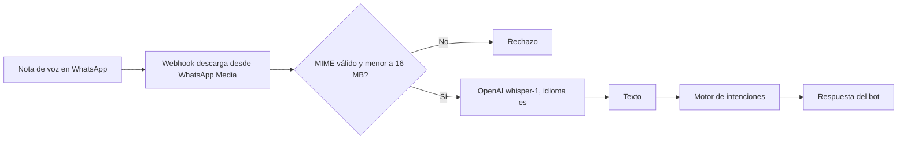

## Motor de intenciones

Cada mensaje de texto pasa por `intent.service.ts`, que clasifica lenguaje natural en español y decide la acción:

- saldo
- enviar USDC
- retiro en efectivo
- retiro a Mercado Pago
- rendimiento (poner, consultar, sacar)
- menú

Si falta un dato (por ejemplo el monto o la red de efectivo), el bot lo pide en la misma conversación antes de ejecutar.

## Pipeline de notas de voz

- **Diseño:** Whisper ejecutado de forma local.
- **Hoy:** la transcripción funciona con Whisper (`whisper-1`) a través de la API de OpenAI, y requiere `OPENAI_API_KEY`.

1. El webhook recibe el mensaje de audio y descarga el archivo desde WhatsApp Media.
2. Se valida el MIME y se rechaza si supera 16 MB.
3. Mandamos el audio a `https://api.openai.com/v1/audio/transcriptions` (`OPENAI_API_KEY`, modelo `whisper-1` por defecto, idioma `es`).
4. El texto entra al mismo motor de intenciones que un mensaje escrito.
5. El bot responde con la misma intención.
