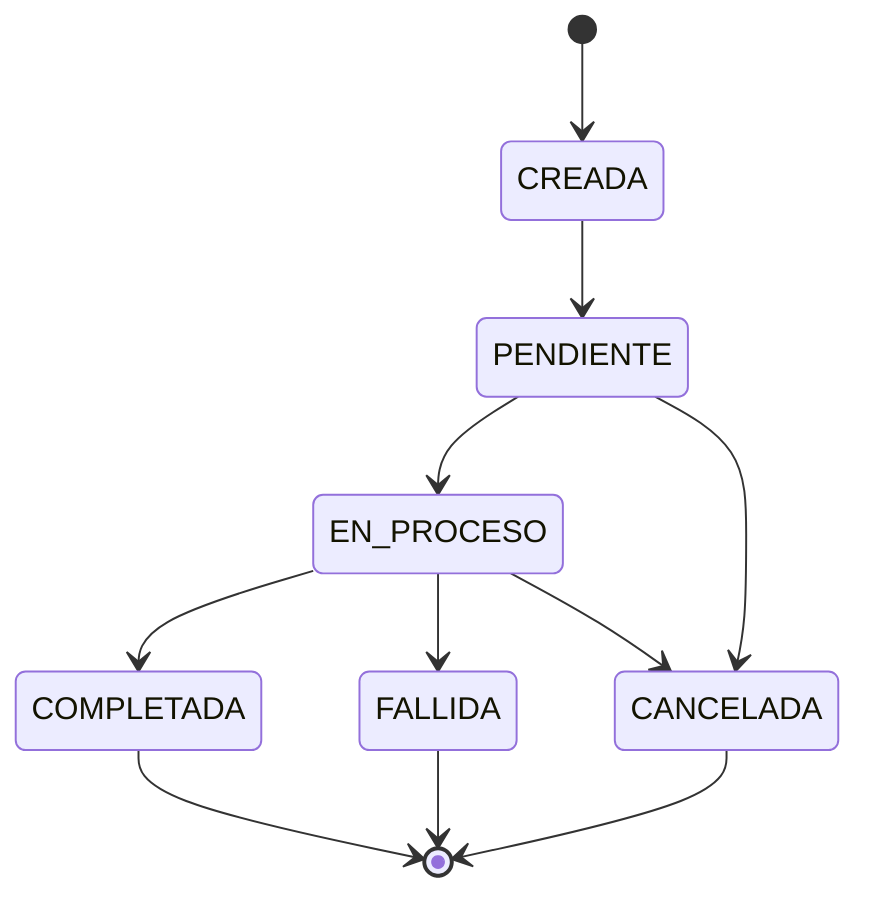
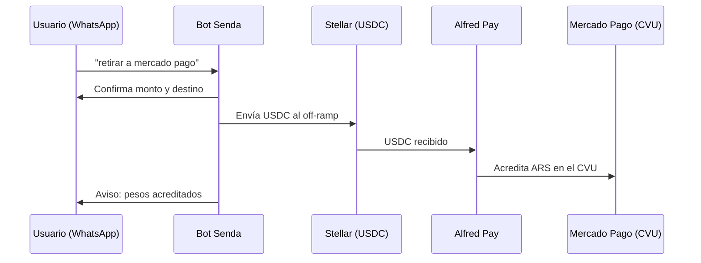
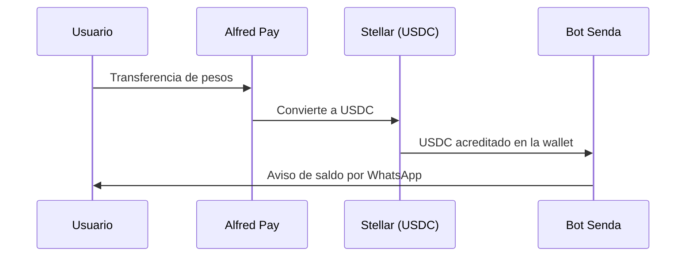
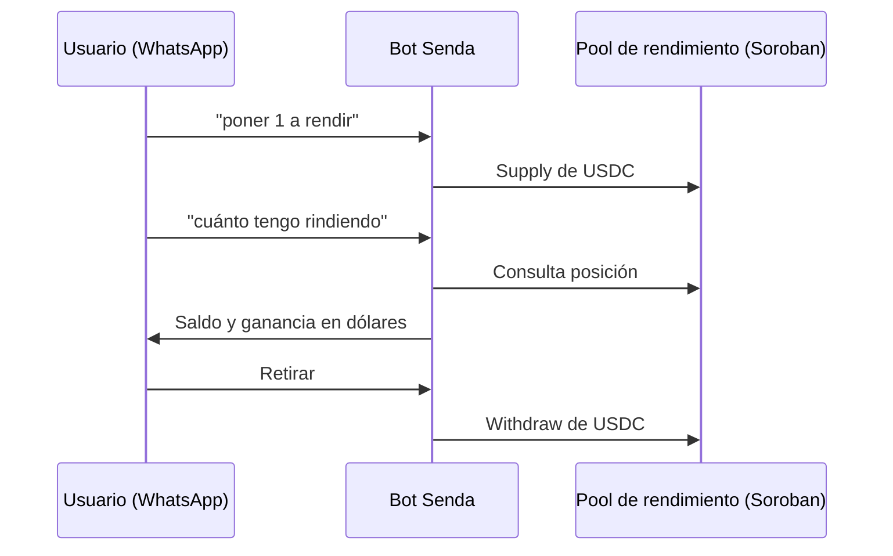

## Máquina de estados del producto

**Diseño:** CREADA → PENDIENTE → EN_PROCESO → COMPLETADA / FALLIDA / CANCELADA, con idempotencia.

Cada transición es idempotente: reintentar el mismo mensaje o la misma llamada no duplica la operación.

**Hoy:** la conversación usa estados `AWAITING_*`; el retiro en efectivo usa `pending_lock` / `pending_pickup` y otros; SEP-24 usa `pending`. La persistencia es `data/senda-db.json`; Prisma en el backend no está activo.

## Flujo de retiro (off-ramp)

**Diseño:** retiro de USDC por WhatsApp hasta que los ARS se acreditan en el CVU de Mercado Pago vía la API de Alfred Pay.

**Hoy:** el retiro a Mercado Pago funciona por SEP-24 contra `testanchor.stellar.org`; el retiro en efectivo (MoneyGram / WU / comercio) es simulado; no hay cliente de Alfred Pay.

## Flujo de ingreso (on-ramp)

**Diseño:** transferencia de pesos convertida automáticamente a USDC sobre Stellar, vía Alfred Pay.

**Hoy:** no hay on-ramp implementado.

## Flujo de rendimientos

**Diseño:** contratos Soroban que generan intereses pasivos en dólares digitales, comunicados al usuario en lenguaje simple.

**Comunicación al usuario:** los intereses se informan en dólares y sin términos técnicos (nada de pools, APY, gas ni contratos). El usuario ve cuánto tiene y cuánto ganó, y puede retirar cuando quiera con el flujo de retiro.

**Hoy:** el rendimiento funciona contra un pool de Blend en testnet (`SupplyCollateral` / `WithdrawCollateral`).
