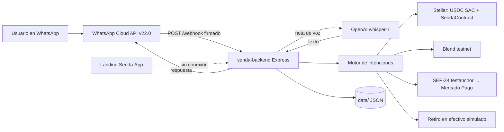

## Componentes

| Componente | Tecnología | Rol |
| --- | --- | --- |
| Landing | Next.js 15, React 19, Tailwind 4, next-intl | Marketing y pitch en Senda.App |
| Backend | Node.js (`>= 22.12.0`) / TypeScript / Express | Webhook de WhatsApp, motor de intenciones, transcripción, orquestación |
| Transcripción | API de OpenAI (`whisper-1`) | Nota de voz → texto |
| Capa blockchain | Stellar (USDC SAC) + SendaContract en Soroban | Settlement, crédito y saldo |
| Rendimientos | Blend (testnet) | Supply / consulta / withdraw de USDC |
| Off-ramp Mercado Pago | SEP-24 contra `testanchor.stellar.org` | Retiro interactivo a Mercado Pago |
| Off-ramp efectivo | Órdenes simuladas (MoneyGram, Western Union, comercio Senda) | Código de retiro y lock de USDC |
| On-ramp / Alfred Pay | Previsto | No está implementado en `senda-backend` |
| Interfaz de chat | WhatsApp Cloud API (v22.0) | Canal del usuario |

## Cómo interactúan

La landing y el backend son despliegues separados. La landing no llama al backend.

## Piezas

### Bot de WhatsApp

WhatsApp Cloud API (versión v22.0 por defecto). El backend expone:

- `GET /webhook` para la verificación de Meta.
- `POST /webhook` para los mensajes, validados con la firma `X-Hub-Signature-256` usando el App Secret de Meta.
- `GET /health` y `GET /media/welcome.mp4`.

### Wallet

- **Diseño:** no-custodial (passkey / smart wallet Soroban).
- **Hoy:** custodia invisible SEP-30; Privy MPC solo si `USE_PRIVY_WALLETS=true`.

### Confidential Token

- **Diseño:** envoltura de USDC con Confidential Token (OpenZeppelin + verificador UltraHonk de Nethermind).
- **Hoy:** el contrato propio del backend es SendaContract (`ping` / `credit` / `balance`) vía `STELLAR_CONTRACT_ID`; no hay Confidential Token integrado en `senda-backend`.

En testnet el backend usa el Stellar Asset Contract de USDC `CDT2MY3QNV2RT2XULQWWXX2JELUWRWNXNKONCYG5MTIGZM7G5S2QNNGB` (`USDC_SAC_CONTRACT_ID`). SendaContract (`STELLAR_CONTRACT_ID`) registra créditos y saldos; no es un Confidential Token.

### Persistencia

El bot escribe JSON en el directorio de datos (`senda-db.json`, sesiones, órdenes de retiro). Prisma existe como referencia (`DATABASE_URL` por defecto `file:../data/senda.db`) y no está activo. Los mensajes de WhatsApp se deduplican por id; los créditos usan un claim idempotente.

La iteración en curso del backend migra la persistencia a SQLite / Supabase: ver [Senda Backend → Persistencia](/docs/backend#persistencia).

### Off-ramp

Mercado Pago vía SEP-10 + SEP-24 (ancla de test). El efectivo (MoneyGram, Western Union, comercio) es una orden simulada que bloquea USDC en el vault de retiro. Alfred Pay es la pasarela prevista, no un cliente en el código.

## Stack de la landing

- Next.js 15
- React 19
- Prisma
- tRPC
- NextAuth
- Tailwind 4
- next-intl

La landing usa Next.js / React / Tailwind / next-intl. Prisma / tRPC / NextAuth están disponibles en el stack; su rol final depende de cómo se conecte Senda.App con `senda-backend`.
