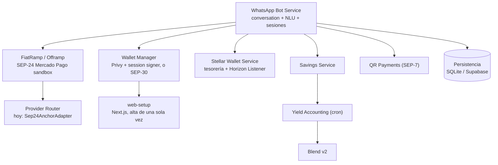

Bot de WhatsApp en español (texto + nota de voz) que mueve USDC en Stellar Testnet sin mostrarle claves ni jerga de blockchain al usuario. Repo: [SendaLabs/senda-backend](https://github.com/SendaLabs/senda-backend).

Hecho para el Argentina Builder Challenge (BAF × Stellar), categoría Genesis. La arquitectura copia el patrón de Azza (pagos y ahorro por WhatsApp en África; SCF #44) y lo adapta a Argentina: ancla SEP-24 en vez de Bridge, destino Mercado Pago / CVU, y wallets diarias MPC Privy en vez de custodia API-level.

<Callout type="warn">
Esta iteración vive en commits de la rama actual de `senda-backend`. Render despliega `main`, así que no está en producción hasta que se haga merge a `main`. Ver [Blockers](#blockers-alcance-honesto).
</Callout>

## Qué es nuevo en esta iteración

Sobre lo que ya existía (saludo, saldo, envío P2P):

- **Wallets MPC vía Privy, self-custodial.** El usuario nuevo recibe un link de un solo uso y abre su wallet una vez en `/web-setup` (login SMS con el mismo WhatsApp). Ahí crea la wallet Stellar y delega el session signer de Senda. El backend no crea la wallet. SEP-30 queda si `USE_PRIVY_WALLETS=false`.
- **Tesorería + Horizon Listener.** Cuenta pooled de Senda, trustline USDC, SSE de pagos con reconexión y backoff. Un depósito no se confirma hasta el evento de Horizon.
- **Retiro a Mercado Pago (nuestro "Bridge").** Provider Router con un adapter SEP-24 (`testanchor.stellar.org` en dev). Completo solo si confirman el ancla y Horizon. WhatsApp avisa cada estado.
- **Ahorro pooled vía Blend v2.** Una tesorería deposita en Blend. El share de cada usuario vive en `YieldPosition` (off-chain). Cron horario + reconciliación diaria. Si el pool está muy usado, se bloquean depósitos.
- **Cobros QR SEP-7.** "generame un link de cobro" manda `web+stellar:pay` como imagen + texto. Si quien paga también usa Senda, paga desde el chat; si no, el link abre Lobstr/Freighter.

## Custodia

Igual que Azza, más Privy.

| Producto | Modelo |
| --- | --- |
| Saldo diario (enviar, recibir, MP, cobros) | Wallet Privy del usuario + session signer de Senda. Fallback SEP-30 si Privy está apagado |
| Rendimiento Blend | Pooled: una posición on-chain de Senda. El share se trackea off-chain y se reconcilia |

## Cómo hablarle al bot

Escribí el número o la frase. También una nota de voz.

| Acción | Ejemplo |
| --- | --- |
| Enviar USDC | `mandar 5` |
| Ver saldo | `cuánto tengo` |
| Pasar a Mercado Pago | `retirar a mercado pago` |
| Poner a rendir | `poner 1 a rendir` |
| Cuánto tengo rindiendo | `cuánto tengo rindiendo` |

También: `generame un link de cobro`. Si te pegan un `web+stellar:pay?...`, Senda intenta pagarlo con tu wallet.

## Arquitectura (nombres al estilo Azza)

No hay BullMQ ni PostgreSQL propio en runtime. No los fingimos.

## Stack

- Node.js 22.12+ / TypeScript / Express
- WhatsApp Cloud API (Graph v22)
- Mini sitio `/web-setup` (Next.js + `@privy-io/react-auth`)
- `@stellar/stellar-sdk`, `@privy-io/node`, `@blend-capital/blend-sdk`, `qrcode`
- Contrato Soroban de laboratorio en `contracts/`, que no entra al flujo del bot

## Blockers (alcance honesto)

El jurado pide evidencia end-to-end en un ambiente desplegado, no solo local.

- **Deploy:** Render lee `main`. Este trabajo vive en commits de la rama actual y no está en producción hasta que se haga merge/push a `main`. Hasta entonces, el e2e desplegado es un blocker explícito.
- **Privy:** sin `PRIVY_APP_ID` / `PRIVY_APP_SECRET` en el host, el bot cae a SEP-30. El patrón MPC no se puede demostrar en el deploy vacío.
- **Mercado Pago real:** el ancla de dev es `testanchor.stellar.org`. Alfred Pay / Ripio Ramps quedan como candidatos de producción; no hay CVU real acreditado.
- **Retiro en efectivo:** fuera del producto. Roadmap interno Instawards. El chat no lo menciona.
- **KYC / tiers:** en Testnet el ahorro no pide documentos.
- **BullMQ, Postgres, Bridge, mainnet:** fuera de scope.

No hay tareas "a medias" en el código. Lo que no llega a producción está acá, no escondido como feature rota.

## Persistencia

En Render (plan free, sin disco) seteá `DATABASE_URL` con la URI de Supabase (Transaction pooler, puerto 6543, `sslmode=require`). Local y tests siguen en SQLite (`data/senda.db` o `SENDA_DATA_DIR`). Si quedan JSON viejos, SQLite los importa una vez al arrancar.

El yield se reconstruye desde Horizon (pagos USDC del usuario a tesorería). Un crédito de "mandar" no se resta; solo baja un retiro con memo `senda-y-out`.

## Contrato SendaContract

Laboratorio (`ping`, `credit`, `balance`). El saldo que ve el usuario es el SAC USDC `CDT2MY3QNV2RT2XULQWWXX2JELUWRWNXNKONCYG5MTIGZM7G5S2QNNGB`.

## Seguridad

- Testnet nada más.
- No subir seeds, `.env` ni `data/`.
- El webhook exige firma HMAC de Meta.
