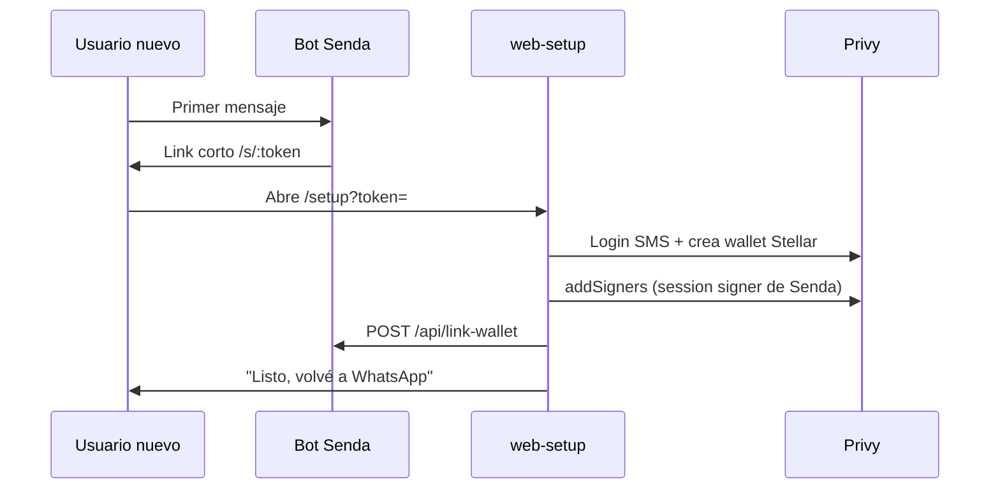

## Setup local

```bash
cp .env.example .env
npm install
npm test
npm run dev
```

- Webhook: `GET` / `POST /webhook`
- Health: `/health`
- Listo para demo: `/ready`

Para conectar WhatsApp, configurá el webhook de la app de Meta con `https://<tu-url-publica>/webhook` y el mismo valor que pusiste en `VERIFY_TOKEN`.

## Alta web (otro proceso)

```bash
cd web-setup
cp .env.example .env.local
npm install
npm run dev
```

El primer mensaje de un número no registrado manda un link corto `/s/:token` → `/setup?token=`. Después de login SMS + wallet + `addSigners`, el sitio hace `POST /api/link-wallet` y muestra "Listo, volvé a WhatsApp".



## Scripts

| Comando | Qué hace |
| --- | --- |
| `npm run dev` | Servidor con recarga (nodemon + ts-node) |
| `npm test` | Tests de `src/services/*.test.ts` |
| `npm run typecheck` | Verifica tipos sin compilar |
| `npm run build` / `npm start` | Compila a `dist/` y ejecuta `dist/index.js` |
| `npm run contract:build` | WASM de laboratorio (`stellar contract build`) |
| `npm run contract:deploy` | Despliega el contrato (`scripts/deploy-contract.js`) |

## Deploy (Render)

1. `main` → build `npm install && npm run build` → start `npm start`.
2. Cargar las variables de entorno en Render (nunca el archivo `.env`).
3. Webhook de Meta: `https://<servicio>/webhook`.
4. Chequear `GET /ready`.

Sin `DATABASE_URL` de Supabase se pierde el mapeo Privy y los tokens de alta en cada redeploy. Con `CUSTODY_MASTER_SECRET` fijo se rederiva la cuenta SEP-30. El yield se rearma desde Horizon.
