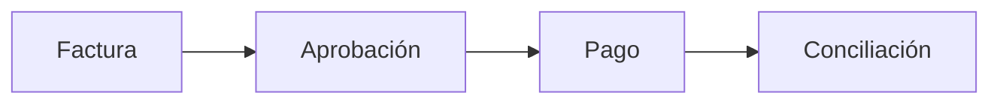

Nuestra tesis de fondo es un **Financial Operations Platform para pymes de LATAM**, con wedge de entrada en Accounts Payable: factura → aprobación → pago → conciliación.

El ADN de "fondos por proyecto/presupuesto" (Fund / Project / Budget) es el diferenciador de ontología frente a plataformas tipo Ramp (Company / Department / Employee).

## Piezas

- **Senda Ledger:** unifica bancos, stablecoins y tarjetas sin obligar a mover fondos a cripto.
- **Payment Router:** decide la mejor ruta de pago (banco, stablecoin, riel local) componiéndose sobre partners de ruteo ya existentes (Bitso Business, CoralCommerce, Eco), sin construirlo desde cero.
- **Senda Asistente:** la capa conversacional (WhatsApp) integrada dentro de Senda para consultas sobre el Senda Ledger real. No asesora sobre inversión ni impuestos.

## El mismo riel

La infraestructura que estamos construyendo (bot de WhatsApp, wallet, settlement invisible sobre Stellar) es la misma pieza que después soporta pagos de negocio a través de fronteras: factura de un proveedor en otro país, pago de un freelancer, conciliación multi-moneda. No es una remesa familiar, pero es el mismo riel.
