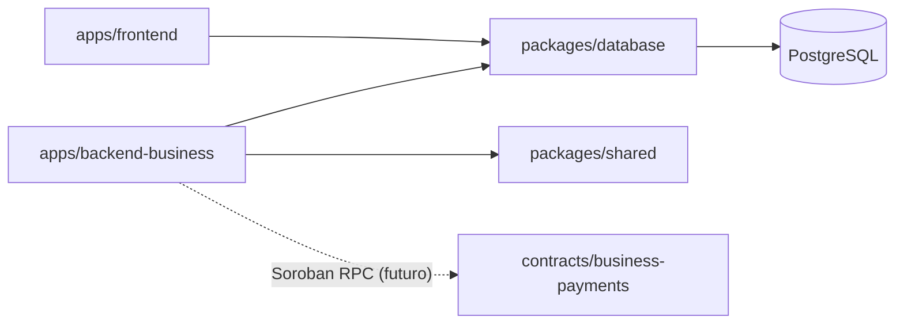
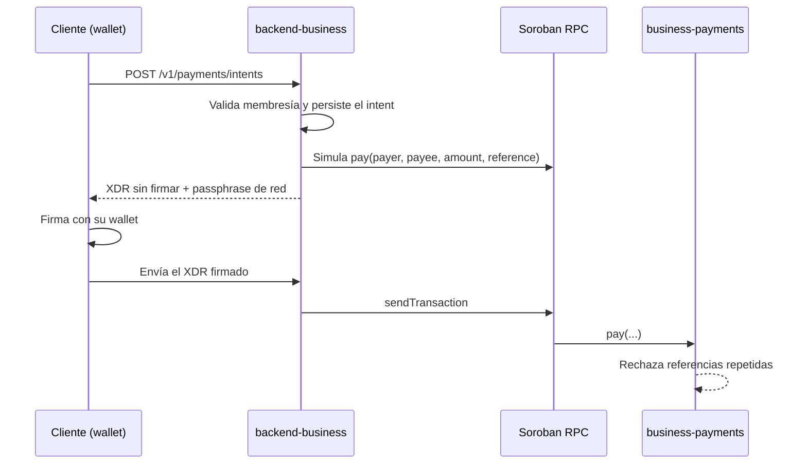

# Arquitectura del monorepo

Este repositorio contiene la cara web de Senda (landing, Senda Business y documentación pública) y el backend corporativo de Senda Business. El bot de WhatsApp vive en un repositorio independiente y **no** forma parte de este monorepo.

## Estructura

```
.
├── apps/
│   ├── frontend/            Next.js 15 (landing, /empresas, /docs)
│   └── backend-business/    NestJS 11 (API corporativa, /v1)
├── packages/
│   ├── database/            Prisma + PostgreSQL (schema, migraciones, cliente)
│   └── shared/              DTOs zod, códigos de error, tipos
├── contracts/               Workspace de Cargo con contratos Soroban
│   └── business-payments/
├── docs/                    Esta documentación técnica
├── package.json             npm workspaces: apps/*, packages/*
└── tsconfig.base.json       Opciones estrictas compartidas
```

`contracts/` queda fuera de los workspaces de npm: se compila con Cargo y se integra con el backend por su dirección de contrato (`BUSINESS_PAYMENTS_CONTRACT_ID`), no por imports.

## Dependencias entre paquetes



Reglas:

- Las apps dependen de los paquetes; los paquetes nunca dependen de las apps.
- `packages/shared` no tiene dependencias de runtime salvo `zod`, así puede usarse también en el frontend.
- Solo `packages/database` conoce Prisma. Las apps importan desde `@senda/database`.

## Backend corporativo (`apps/backend-business`)

Capas por módulo:

| Capa | Ubicación | Responsabilidad |
|---|---|---|
| Rutas | `src/app.routes.ts` | Mapa público de URLs por módulo (`RouterModule`), todo bajo `/v1` |
| Controllers | `src/modules/*/*.controller.ts` | HTTP: validan la entrada con los DTOs de `@senda/shared` y delegan |
| Services | `src/modules/*/*.service.ts` | Reglas de negocio; lanzan `AppError` con códigos tipados |
| Modelos | `packages/database/prisma/schema.prisma` | Tablas y relaciones |
| DTOs | `packages/shared/src/dto` | Contratos de entrada compartidos |
| Infraestructura | `src/infrastructure` | Base de datos y gateway de Stellar, detrás de interfaces |

Transversales en `src/common` y `src/config`:

- **Configuración:** `loadConfig` valida el entorno con zod al arrancar y corta si falta algo; los mensajes nunca muestran los valores.
- **Errores centralizados:** `AllExceptionsFilter` convierte cualquier excepción en `{ error: { code, message, requestId, details? } }`. Los errores desconocidos se loguean con stack y se responden como `INTERNAL` sin detalles internos.
- **Seguridad:** helmet, CORS con lista blanca, rate limiting global (más estricto en `/auth`), límite de body de 100 kB, `x-powered-by` deshabilitado y `trust proxy` solo si se configura.
- **Observabilidad:** logs JSON con pino, `x-request-id` por request (se acepta el del proxy si es seguro) y redacción de `authorization`, cookies y contraseñas.
- **Contraseñas:** scrypt nativo de Node con parámetros dentro del hash, para poder subir el costo sin invalidar los existentes.

### Estado de los módulos

| Módulo | Estado |
|---|---|
| `health` | Funcional: liveness y readiness (chequea PostgreSQL) |
| `auth` | Validación lista; registro y login responden `501 NOT_IMPLEMENTED` |
| `companies` | Validación lista; persistencia pendiente (`501`) |
| `payments` | Validación de intents Stellar lista; integración Soroban pendiente (`501`) |

## Base de datos (`packages/database`)

PostgreSQL con Prisma. El schema reúne los modelos del frontend (Auth.js, waitlist) y los corporativos:

- `business_users`: usuarios corporativos con `password_hash`.
- `companies`: razón social, identificación fiscal y país (ISO 3166-1).
- `company_memberships`: relación usuario-empresa con rol `OWNER | ADMIN | MEMBER`.
- `business_sessions`: sesiones opacas; solo se guarda el SHA-256 del token.

Las migraciones viven en `packages/database/prisma/migrations` y se aplican con `npm run db:migrate:deploy` en cada entorno.

## Stellar y Soroban

El backend nunca custodia claves de usuarios. El flujo previsto para pagos corporativos:



`StellarGateway` (`src/infrastructure/stellar`) es la única frontera con el SDK. Hoy se inyecta `UnconfiguredStellarGateway`, que responde `NOT_IMPLEMENTED`.

El contrato `business-payments` mueve un único activo fijado al desplegarse (por ejemplo, el SAC de USDC), exige la firma del pagador sobre los argumentos exactos y usa la `reference` de 32 bytes como clave de idempotencia. Es inmutable: no tiene admin ni `upgrade`.
